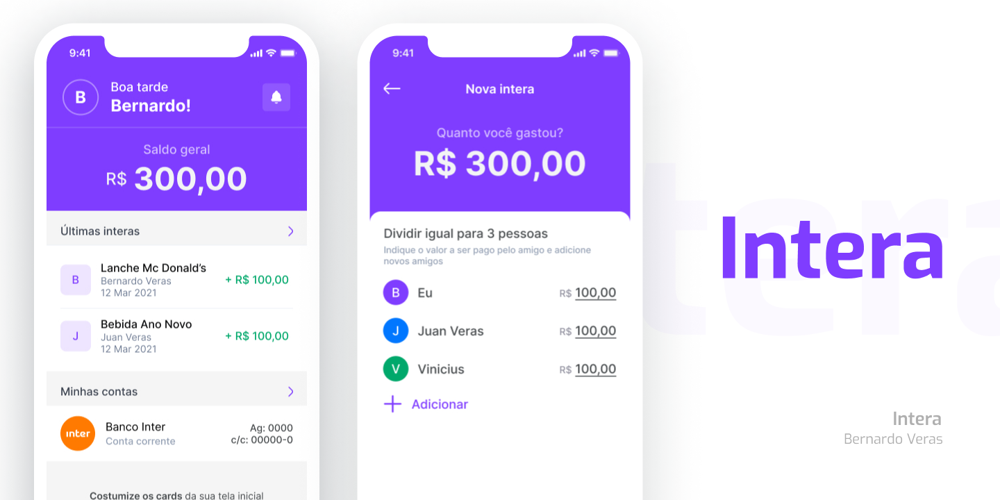

> Quer ver como ta ficando? Acessa a [**DEMO**](https://pokedex.omariosouto.now.sh/)

  

## Contributing/Contribuir
Quer contribuir com o projeto? [Confira o passo a passo](./CONTRIBUTING.md)
Quer ver o que está por vir? [Acompanhe aqui](https://github.com/bernardoveras/intera-frontend/projects)

## Versioning/Versionamento

Esse projeto não possui um sistema de versionamento.

## History/Histórico
Da uma olhada na aba [Releases](https://github.com/bernardoveras/intera-frontend/releases) pra acompanhar as alterações feitas no projeto.

## License/Licença do Projeto
[MIT License](./LICENSE) © [Bernardo Veras](https://github.com/bernardoveras)